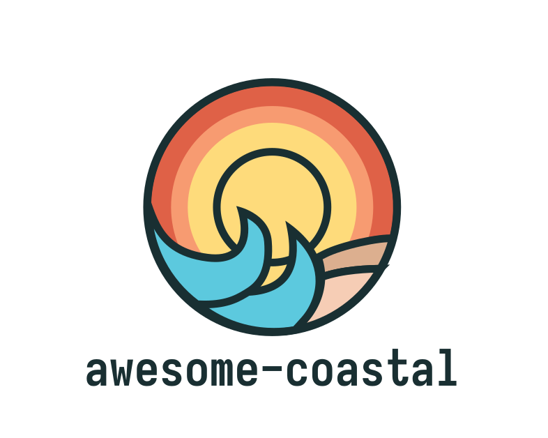

  

----

This is a list of resources which coastal engineers and scientists might find useful. Since we're a fairly niche discipline, it's often difficult to find out about all the great things out in the community! This list brings together useful data-sets, tools and scripts that people might not have been aware of.

<!-- START doctoc generated TOC please keep comment here to allow auto update -->
<!-- DON'T EDIT THIS SECTION, INSTEAD RE-RUN doctoc TO UPDATE -->
### Contents

  - [Contributing](#contributing)
- [By topic](#by-topic)
  - [Beach erosion](#beach-erosion)
  - [Wave modelling](#wave-modelling)
  - [Terrestial and UAV video analysis](#terrestial-and-uav-video-analysis)
  - [Satellite remote sensing](#satellite-remote-sensing)
  - [Early warning systems](#early-warning-systems)
- [By location](#by-location)
  - [Global](#global)
  - [Australia](#australia)
  - [New Zealand](#new-zealand)
  - [USA](#usa)
  - [Europe](#europe)
- [Community](#community)
- [Related lists](#related-lists)

<!-- END doctoc generated TOC please keep comment here to allow auto update -->

----

### Contributing
If you have any resources that could be useful for coastal engineers and scientists please let us know! This list is mainly focussed on data-sets and software packages that have been developed (and less so on listing papers, reports or books). Contributing can be done in one of two ways:

1. If you're comforatable with Github, make a [pull request](https://github.com/chrisleaman/awesome-coastal/pulls)
2. Or else, open a [new issue](https://github.com/chrisleaman/awesome-coastal/issues)
3. You pull request or issue should provide a link to a resource and a description of what it does and why it might be useful.

----

## By topic

### Storm impacts (beach erosion, dune erosion etc.)
- [TomasBeuzen/autobeach](https://github.com/TomasBeuzen/PH12_Dune_Erosion_Model): Python tool for automatically identifying beach profile features such as dune toes, dune crests, beach width and beach slopes.
- [TomasBeuzen/PH12_Dune_Erosion_Model](https://github.com/TomasBeuzen/PH12_Dune_Erosion_Model): Matlab and Python implementations of dune erosion models.
- [XBeach](https://oss.deltares.nl/web/xbeach/): Open sourced, processed-based model for beach and dune erosion.
- 🆕 [danoroelvink/shorelines](https://github.com/danoroelvink/shorelines): Free-form coastline simulation with the ShorelineS program ([journal article](https://www.frontiersin.org/articles/10.3389/fmars.2020.00535/full)).
- 🆕 [danoroelvink/duna](https://github.com/danoroelvink/duna): Duna model for wind-driven morphology change of coastal profiles ([journal article](https://www-sciencedirect-com.wwwproxy1.library.unsw.edu.au/science/article/pii/S1364815218309095)).

### Wave modelling
- 🆕 [teslakit/teslakit](https://github.com/teslakit/teslakit): Python3 collection of libraries for numerical and statistical calculations and methodologies for handling global climate data.
- 🆕 [tsutterley/pyTMD](https://github.com/tsutterley/pyTMD): Python-based tidal prediction software that reads OTIS, GOT and FES formatted tidal solutions.
- 🆕 [CHLNDDEV/oceanmesh](https://github.com/CHLNDDEV/oceanmesh): Automatic coastal ocean mesh generation in Python and C++.
- 🆕 [akarimp/oceanlyz](https://github.com/akarimp/oceanlyz): Python toolbox for analysing wave time series data.
- 🆕 [anellenson/DecisionTree_WaveForecasts](https://github.com/anellenson/DecisionTree_WaveForecasts): Machine learning algorithm to determine and describe error patterns within wave model output.
- [chrisleaman/py-wave-runup](https://github.com/chrisleaman/py-wave-runup): Python package with many empirical wave runup equations for sandy beaches.
- [TomasBeuzen/BeuzenEtAl_GP_Paper](https://github.com/TomasBeuzen/BeuzenEtAl_GP_Paper): Python Juypter notebook demonstrating a Gauassian-Process machine learning implementation of wave runup prediction.
- [Power et al. (2018) runup data](https://www.sciencedirect.com/science/article/pii/S0378383918302552): 1391 wave runup records collated from a variety of sources.
- [Field Research Facility LiDAR Runup measurements](https://frfdataportal.erdc.dren.mil/): Wave runup measurements taken by the LiDAR at the FRF in North Carolina, USA.
- [SWASH](http://swash.sourceforge.net/): SWASH is a general-purpose numerical tool for simulating unsteady, non-hydrostatic, free-surface, rotational flow and transport phenomena in coastal waters as driven by waves, tides, buoyancy and wind forces.
- [umwm/umwm](https://github.com/umwm/umwm): Opensource code University of Miami Wave Model, a third-generation spectral ocean wave model.
- 🆕 [georgebv/coastlib](https://github.com/georgebv/coastlib): coastlib is a Python library dedicated to solving problems related to the discipline of coastal engineering, such as enivronmental data collection (NOAA CO-OPS and NCEI, and WAVEWATCH III, etc.), extreme value analysis (EVA), data analysis and visualization, wave theories, and many more.

### Terrestial and UAV video analysis
- 🆕 [caiostringar/picoastal](https://github.com/caiostringari/picoastal): Coastal video monitoring using a Raspberry Pi.
- 🆕 [caiostringar/deepwaves](https://github.com/caiostringari/deepwaves): Identifying wave breaking in videos.
- [Coastal Imaging Research Network](https://github.com/Coastal-Imaging-Research-Network): The CIRN organisation provides toolboxes to estimate bathymetry from video (cBathy) taken from fixed ARGUS stations or UAVs. Repos include the cBathy toolbox, UAV processing toolbox and image calibration and rectification routines. Currently all code uses MATLAB.
- 🆕 [mailemccann/coastalimagelib](https://github.com/mailemccann/coastalimagelib): Python-based library that produces common coastal image products intended for quantitative analysis of coastal environments. 
- [CoastSnap](https://github.com/Coastal-Imaging-Research-Network/CoastSnap-Toolbox): MATLAB toolbox to extract shorelines from pictures of beaches taken by the global community. More info [here](https://www.environment.nsw.gov.au/research-and-publications/your-research/citizen-science/digital-projects/coastsnap) and [here](https://www.facebook.com/coastsnap/).
- [caiostringari/pywavelearn](https://oss.deltares.nl/web/xbeach/): pywavelearn provides a number of python scripts to process video of the swash zone. It provides functions to calibrate and rectify camera images, generate timestacks and classify pixels to track wave breaking.
- [simmonsja/cnn-shoreline-detect](https://github.com/simmonsja/cnn-shoreline-detect): Shoreline detection on oblique images of beaches using a HED CNN approach and Python.
- [dbuscombe-usgs/IR_waveclass](https://github.com/dbuscombe-usgs/IR_waveclass): Software and data for training deep convolutional neural network models to classify wave breaker type from IR images of breaking waves in the surf zone using Python. 
- [rgerum/cameratransform](https://github.com/rgerum/cameratransform): Python package to fit camera properties and perform transformation from pixel to real-world coordinates and back again.
- [conlin-matt/SurfRCaT](https://github.com/conlin-matt/SurfRCaT): Surf-Camera remote calibration tool that allows for the rectification of imagery from any coastal camera that views structures identifiable in lidar data.
- [jonghyunharrylee/pyPCGA](https://github.com/jonghyunharrylee/pyPCGA/blob/master/examples/stwave_duck/inversion_stwave.ipynb): Example of bathymetric invesion using STWAVE.

### Satellite remote sensing
- 🆕[mcuttler/CoastSat.islands](https://github.com/mcuttler/CoastSat.islands): An extension of CoastSat adapted to measure the planform area of islands.
- 🆕[Sentinel-2 Water Edges Dataset](https://openmldata.ukho.gov.uk/): A dataset for deep learning applications containing annotated Sentinel-2 imagery.
- [kvos/CoastSat](https://github.com/kvos/CoastSat): CoastSat is a python package which
  processes LandSat imagery (over 30 years available) and extracts shorelines using a sub-pixel resolution technique.
- [dbuscombe-usgs/EarthAnnotator](https://github.com/dbuscombe-usgs/EarthAnnotator): A tool for web-based image annotation and efficient labeling pixels in images using Python
- 🆕 [Subpixel_waterlines](https://github.com/GeoscienceAustralia/dea-notebooks/tree/subpixel_waterlines): Python code and Jupyter Notebooks for extracting sub-pixel resolution waterlines from large multidimensional satellite datasets (e.g. from Open Data Cube or Google Earth Engine)

### Early warning systems
- [Emilia-Romagna Storm Early Warning System](https://geo.regione.emilia-romagna.it/schede/ews/): Storm impact early warning system for the Italian coastline.
- [SWEEP OWWL](https://www.channelcoast.org/ccoresources/sweep/): Wave overtopping forecasting system for the southwest coast of the UK.
- 🆕 [USGS Total Water Level and Coastal Change Forecast Viewer](https://coastal.er.usgs.gov/hurricanes/research/twlviewer/): Total Water Level forecasts along the East Atlantic US coastaline.

### Sediment size
- 🆕 [SandSnap](https://sandsnap-erdcchl.hub.arcgis.com/): A collaborative project engaging citizen scientists in creating a sand grain database and educating the next generation about coastal processes.

## By location

### Global
- 🆕 [Coastal Futures](https://coastal-futures.org/): A one stop viewer for 21st century projections of climatic impact-drivers  (CIDs) leading to coastal impacts and risk
- 🆕 [Blue Earth Data](https://blueearthdata.org/data/w): Global water data platform providing water level, wind, wave forecasts by Deltares.
- 🆕 [GeoMapApp](http://www.geomapapp.org/): Downloadable application for browsing, visualizing and analyzing a diverse suite of curated global and regional geoscience data sets. 
- 🆕 [Global Multi-Resolution Topography Data Synthesis](https://www.gmrt.org/): GMRT is a single, continuously ipdate compilation of global topobathy data worldwide.
- 🆕 [Opentopodata.org](https://www.opentopodata.org/): Access a variety of open topo and bathy data from a REST API server.
- 🆕 [Awesome-DEM](https://github.com/DahnJ/Awesome-DEM): List of global and local DEM resources (both free and proprietary).
- [Aviso FES2014 Global Tide Database](https://www.aviso.altimetry.fr/en/data/products/auxiliary-products/global-tide-fes.html): Predicted tide elevations, currents and loadings on a 1/16 x 1/16 degree grid for anywhere in the world. Simple to use python interface provided at [cnes_aviso/fes](https://bitbucket.org/cnes_aviso/fes/src/master/).
- [WAVEWATCH III](https://polar.ncep.noaa.gov/waves/): Global wave model supplying hindcasts and forecasts around the world. Development has been recentl move to the open-source [NOAA-EMC/WW3](https://github.com/NOAA-EMC/WW3) repo.
- [fitnr/buoyant](https://github.com/fitnr/buoyant): Buoyant is a Python wrapper for grabbing buoy data from the National Buoy Data Center. It parses CSV from the SDF endpoint and images from the BuoyCam service.
- [ECMWF ERA5](https://www.ecmwf.int/en/forecasts/datasets/reanalysis-datasets/era5): Global climiate reanalysis which includes ocean waves. ERA5 data released so far covers the period from 1979 to 2-3 months before the present.
- [Global Sea Level Observing System](https://www.psmsl.org/data/): Tide observations from a global network of gauges. 
- [Global Extreme Sea Level Analysis](https://www.gesla.org/): Worldwide dataset of frequency and magnitude of extreme sea levels.
- [GEBCO global bathymetry](https://www.gebco.net/data_and_products/gridded_bathymetry_data/): Global terrain model for ocean and land at 15 arc-second intervals.
- [OpenCoastS](https://opencoasts.ncg.ingrid.pt/): On-demand ocean forecasting system for coastal areas providing water levels, velocities and wave parameters.
- [MERIT DEM](http://hydro.iis.u-tokyo.ac.jp/~yamadai/MERIT_DEM/): Improved global DEM at 3 arc-second resolution.
- [CoastalDEM](https://go.climatecentral.org/coastaldem/): Global DEM with improved error correction around coastal areas.

### Australia
- 🆕 [CoastKit Victoria](https://mapshare.vic.gov.au/coastkit/): Collection of coastal infrastructure, assets, hazards and monitoring information for the Victorian coastline.
- 🆕 [CSIRO Australian Topobathy](https://data.csiro.au/collection/csiro:52379v2): Merged topobathy for Australia at 250 m resolution.
- 🆕 [AODN Portal](https://portal.aodn.org.au/): Australian marine and climate science data provided by IMOS.
- 🆕 [NSW Ocean Wave Data](https://www.mhl.nsw.gov.au/Data-Wave): Real-time measurements of offshore wave data along the NSW coastline.
- 🆕 [NSW Nearshore wave buoy parameters](https://geo.seed.nsw.gov.au/Public_Viewer/index.html?viewer=Public_Viewer&locale=en-AU&runWorkflow=AppendLayerCatalog&CatalogLayer=SEED_Catalog.286.buoy_status): Real-time measurments of nearshore wave data along the NSW coastline ([more info](https://datasets.seed.nsw.gov.au/dataset/nsw-nearshore-wave-buoy-parameter-time-series-data-active-deployments)).
- 🆕 [GeoscienceAustralia/dea-coastlines](https://github.com/GeoscienceAustralia/dea-coastlines): Annual shorelines and rates of coastal change along the entire Australian coastaline from 1988 to present.
- 🆕 [Elevation Foundation Spatial Data](https://elevation.fsdf.org.au/): Collection of point cloud and elevation datasets covering Australia.
- 🆕 [Vicwaves.com.au](https://vicwaves.com.au/): Wave buoy observations along the Victorian coastline.
- 🆕 [ICSM Historical Aerial Photography](https://imagery.aerialphotography.fsdf.org.au/): Historical aerial photography around Australia dating back to 1928.
- 🆕 [Western Australia Coastal Images](http://wacoastline.org/): Historical oblique aerial images on WA coastline between Busselton and Rockingham.
- 🆕 [Western Australia Waves](https://wawaves.org/): Waves observations from wave buoys on the WA coastline.
- [Narrabeen-Collaroy Beach Survey Program](http://narrabeen.wrl.unsw.edu.au/): Long-term data set (40+ years) of beach profiles at Narrabeen-Collaroy (Sydney Northern Beaches).
- [NSW Neashore Wave Transfomation toolbox](https://forecast.waves.nsw.gov.au/index.php?init=1&cont=10&zoom=7&mod=20): Tools to transform offshore wave contours to 10m and 30m depth contour. Can provide historic nearshore wave conditions based on WaveRider buoys and WaveWatch 3 data from 1980.
- [Geoscience Australia Intertidal DEM (NIDEM) and High/Low Tide Composites](https://nationalmap.gov.au/): DEM and satellite composite images at low and high tide for entire Australian coastline. (Click `Explore data` -> `Marine and Oceans` -> `Coastal`).
- [Coastal Sediment Compartments](https://ecat.ga.gov.au/geonetwork/srv/eng/catalog.search#/metadata/87838): The entire Australian shoreline broken up into primary, secondary and tertiary sediment comparments.
- [Smartline](https://ecat.ga.gov.au/geonetwork/srv/eng/catalog.search#/metadata104160): Geomorphology data provided for the entire Australian shoreline.
- [Coastal Risk Australia](http://coastalrisk.com.au): Maps of predicted coastal flooding resulting from climate change
- [NSW Beach Profile Database](http://www.nswbpd.wrl.unsw.edu.au/): Beach profiles from 150 locations along the NSW Coast, from as far north as Tweed Heads and to as far south as Eden. Data available for download.
- [Australian Ocean Data Network](https://portal.aodn.org.au/search): The AODN Portal provides access to all available Australian marine and climate science data.
- [CAWCR Wave Hindcast](https://data.csiro.au/collections/#collection/CIcsiro:39819/BTkw/BVwave/RP1/RS25/RORELEVANCE/STnull/RI1/RT4/): WaveWatch III hindcast with high resolutions in the Western Pacific and Australian regions. Hindcast dates available from 1979 to 2014.
- [Extreme Sea Levels in Australia](http://sealevelx.ems.uwa.edu.au/): Present day extreme sea level statistics around Australia.

### New Zealand
- [NZ Storm Surge Hindcast](https://uoa-eresearch.github.io/storm_surge/#Model_20CR@1871-01-01): Hindcast of NZ storm surge at 0.25 degrees.

### USA
- 🆕[U.S. Interagency Elevation Inventory](https://coast.noaa.gov/inventory/): Nationwide listing of publically available topography and bathymetry for the US.
- 🆕 [UNCG-DAISY/psi-collect](https://github.com/UNCG-DAISY/psi-collect): Collect Post-Storm Imagery from NOAA.
- [Field Research Facility, Duck NC](https://frfdataportal.erdc.dren.mil/): Long term monitoring and extensive field campaigns with geomorphology, meteorology, oceanography data sets available for download.
- [San Diego beach dataset](https://www.nature.com/articles/s41597-019-0167-6): Beach profiles and wave conditions at three southern California beaches during 2001-2016. (Ludka et al, 2019)
- [SECOORA Data Portal](https://portal.secoora.org/): Centralized access to Southeast U.S. coastal and ocean data.

### Europe
- 🆕 [Bertin, 2022](https://www.nature.com/articles/s41597-022-01170-3): 16 years of beach profile surveys at Porsmilin, northwest France.
- 🆕 [Lerma et al, 2022](https://doi.org/10.1016/j.apgeog.2022.102645): 11 years of beach profiles along 230 km of the Aquitaine, southwest France.
- 🆕 [Castelle et al, 2020](https://www.nature.com/articles/s41597-020-00750-5#Sec9): 16 years of topographic surveys of Truc Vert beach, southwest France.
- 🆕 [National Network of Regional Coastal Monitoring Programmes](https://coastalmonitoring.org/): The Network collects coastal monitoring data across six regional programs.
- [Channel Coast Observatory](https://www.channelcoast.org/ccoresources/): Beach profiles, wave and tide data, model predictions for several sites around the UK.
- [Ruessink et al, 2019](https://zenodo.org/record/2635416): A multi-year data set of beach-foredune topography and environmental forcing conditions at Egmond aan Zee, the Netherlands.

## Community
- [Coastal List](https://groups.google.com/a/udel.edu/forum/#!categories/coastal_list): Possibly the largest coastal engineer/scientist mailing list with over 6800 subscribers. Run by the University of Delware, job ads, student opportunities, workshops, training courses and conferences are all posted here.
- [Earth science jobs list](https://docs.google.com/spreadsheets/d/1-i6zRM8aQnLswnpQOmqUZ3zqzph9L7hg5kccIkqiA80/edit#gid=989950331): Google spreadsheet of list of available earth science faculty jobs.

## Related lists
- [Awesome-Spatial](https://github.com/RoboDonut/awesome-spatial): Awesome list for geospatial.
- [Awesome Open Geoscience](https://github.com/softwareunderground/awesome-open-geoscience): Awesome list for open-source geoscience. Items lean towards subsurface geoscience but significant overlap with coastal geoscience.
- [Awesome Open Climate Science](https://github.com/pangeo-data/awesome-open-climate-science): Awesome list for atmospheric, ocean, aWnd climate sciences.
- [SpatialPoints.com Useful Resources](http://www.spatialpoints.com/2019/05/06/useful-resources/): The Spatial Sciences Group at The University of Adelaide's list of useful resources.

